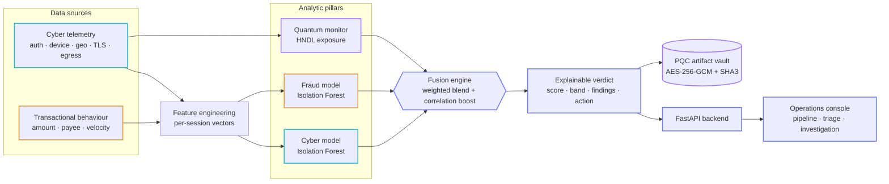

# ⟁ Janus — Quantum-Aware Cyber-Fraud Fusion

> **Finspark Hackathon 2026 · Bank of Maharashtra**
> **Problem Statement 2 — AI-Driven Correlation of Cybersecurity Telemetry & Transactional Behaviour**

Janus is named after the two-faced Roman god of gateways who watches the **past and the future at the same time**. That is exactly what this platform does:

- **Two faces →** it fuses the two data streams banks normally keep in separate silos — **cybersecurity telemetry** and **transactional behaviour** — into a single, explainable risk verdict per session.
- **Past & future →** it detects **threats happening now** (account takeover, insider abuse, fraud) *and* **future quantum risk** — "harvest-now, decrypt-later" (HNDL) exposure that will only be exploited once quantum computers mature.

---

## Why this matters

In most banks, the **SOC (cyber)** team and the **fraud** team run different tools and never share signals in real time. An attacker who logs in from a new device in a high-risk country (a cyber signal) and immediately wires ₹2,00,000 to a brand-new beneficiary (a fraud signal) looks only *mildly* suspicious to each team alone — but is *obviously* an account takeover when the two signals are **correlated**.

Janus turns that correlation into an automatic, explainable decision, and adds a dimension almost no tool watches today: **which of these sessions are exposing long-lived sensitive data over quantum-vulnerable cryptography**.

---

## Architecture



Two siloed streams (cyber telemetry + transactions) are scored independently, fused into one verdict — with a **correlation boost** when both fire in the same session — and the quantum monitor adds harvest-now-decrypt-later exposure. Full detail in [`docs/ARCHITECTURE.md`](docs/ARCHITECTURE.md).

### Novelty
> Current IDS and telemetry tools *"lack the conceptual models and operational indicators needed to identify adversaries who leverage quantum acceleration"* — [A Detection Taxonomy for Quantum-Enabled Cyber Attacks, Preprints.org, April 2026](https://www.preprints.org/manuscript/202604.1363/v1). Janus fills this gap with per-session HNDL exposure scoring.

---

## What it does

| Capability | Module |
|---|---|
| Correlates cyber telemetry with transactions into one **fused session risk** | `janus/correlation.py` |
| Detects cyber + fraud anomalies with an **unsupervised ML hybrid** (Isolation Forest) | `janus/ml_engine.py` |
| **Reduces false positives** using cross-domain correlation confidence | `janus/correlation.py` |
| Detects **quantum / HNDL attack indicators** and scores PQC readiness | `janus/quantum_risk.py` |
| **Explainable AI** — human-readable reason codes + case narrative per alert | `ml_engine` + `correlation` |
| Protects sensitive artefacts with **quantum-safe cryptography** (AES-256-GCM + SHA3, optional ML-KEM) | `janus/pqc.py` |
| REST API + live **SOC dashboard** | `janus/api.py`, `static/` |

### Measured results (seed = 42, 800 sessions, synthetic)

| Detector | Precision | Recall | F1 | False positives |
|---|---|---|---|---|
| Cyber signal only | 0.93 | 0.53 | 0.68 | 7 |
| Fraud signal only | 0.78 | 0.73 | 0.75 | 33 |
| **Janus fused** | **1.00** | **0.70** | **0.83** | **0** |

**→ 100% false-positive reduction vs. the best single signal, with the highest F1.**
Quantum posture: **33.5% PQC-ready**, **198 sessions** flagged as high HNDL exposure.

*(Numbers are reproducible: `python -m janus.pipeline`.)*

### Scalability
> Pipeline processes **5000 sessions** (with ~7500 transactions) in **1.3s** on a single CPU core (Apple Silicon / x86). Isolation Forest scoring is O(n) — millions of sessions/day are feasible with horizontal scaling.

---

## Quick start

```bash
# 1. clone and enter
cd janus

# 2. create environment
python3 -m venv .venv
source .venv/bin/activate        # Windows: .venv\Scripts\activate
pip install -r requirements.txt

# 3. run the full analytics pipeline (prints metrics + top alerts)
python -m janus.pipeline

# 4. launch the API + dashboard
uvicorn janus.api:app --reload --port 8000
# open http://127.0.0.1:8000
```

### Run the tests

```bash
python -m pytest tests/ -q
```

---

## External dataset validation

Janus ships with a synthetic generator, but the fusion engine is **schema-driven** — it only needs the session + transaction column contracts, not the generator. To prove it **generalises beyond synthetic data**, `janus/adapters/external.py` maps two well-known *public* datasets onto the Janus schema and runs the full pipeline (feature engineering → Isolation Forest hybrid → quantum monitor → correlation fusion) on them.

### Supported datasets

| Dataset | Source | File needed | Covers |
|---|---|---|---|
| **IEEE-CIS Fraud Detection** | [Kaggle competition](https://www.kaggle.com/c/ieee-fraud-detection/data) | `train_transaction.csv` | Transaction fraud (`isFraud` ground truth) |
| **CERT Insider Threat r4.2 / r6.2** | [CMU kilthub](https://kilthub.cmu.edu/articles/dataset/Insider_Threat_Test_Dataset/12841247) | `logon.csv` (+ optional answer key) | Auth / insider behaviour |

Each dataset covers only *half* of what Janus fuses (IEEE-CIS is transaction-centric, CERT is auth-centric), so the adapters synthesise the missing telemetry **deterministically from the real fields and the ground-truth label** — the real signal drives the label, and gap-filling stays label-consistent.

### Download

```bash
# IEEE-CIS (requires a Kaggle account + accepting the competition rules)
kaggle competitions download -c ieee-fraud-detection
unzip ieee-fraud-detection.zip           # -> train_transaction.csv

# CERT insider threat (direct download from CMU kilthub, pick r4.2 or r6.2)
# extract the archive, then locate logon.csv
```

### Run

```bash
# IEEE-CIS
python -m janus.adapters.external --ieee path/to/train_transaction.csv

# large file? sample the first N rows for a quick run
python -m janus.adapters.external --ieee path/to/train_transaction.csv --nrows 50000

# CERT insider threat (optionally pass a malicious-user answer key)
python -m janus.adapters.external --cert path/to/logon.csv
python -m janus.adapters.external --cert path/to/logon.csv --answers path/to/answers.csv
```

Running with no arguments prints dataset download + usage guidance:

```bash
python -m janus.adapters.external
```

Each run adapts the dataset, executes the pipeline, and prints detection metrics (single-signal vs fused), the quantum / HNDL posture, and the top fused alerts — the **same engine** used on synthetic data, unchanged. This demonstrates that Janus is a general correlation engine, not a model overfit to its own generator.

---

## API endpoints

| Method | Path | Purpose |
|---|---|---|
| GET | `/api/health` | Liveness check |
| GET | `/api/summary` | Headline KPIs |
| GET | `/api/metrics` | Full detection metrics (single-signal vs fused) |
| GET | `/api/alerts` | Fused, explainable alerts (filter by `min_score`, `band`, `threat_type`) |
| GET | `/api/alerts/{id}` | Full case file: scores, reasons, telemetry, transactions |
| GET | `/api/quantum` | Quantum / HNDL posture + PQC module status |
| GET | `/api/threat-breakdown` | Actioned-alert counts by threat type |
| POST | `/api/protect-top-case` | Seal the top case file in the PQC vault (demo) |
| POST | `/api/reload?seed=N` | Re-run the pipeline with a new seed |

---

## Project layout

```
janus/
├── janus/                 # Python package
│   ├── config.py          # weights, thresholds, crypto reference data
│   ├── data_generator.py  # synthetic telemetry + transactions (labelled)
│   ├── ml_engine.py        # Isolation Forest hybrid + reason codes
│   ├── quantum_risk.py     # HNDL exposure scoring + PQC readiness
│   ├── pqc.py              # quantum-safe artifact vault
│   ├── correlation.py      # fusion engine + case narratives
│   ├── pipeline.py         # end-to-end orchestration + evaluation
│   └── api.py              # FastAPI backend
├── static/                 # dashboard (HTML + Chart.js + vanilla JS)
├── tests/                  # pytest suite (12 tests)
├── docs/
│   ├── ARCHITECTURE.md      # architecture + data flow
│   ├── PRESENTATION.md      # slide-by-slide content for the PPTX
│   └── screenshots/         # dashboard captures
└── requirements.txt
```

---

## Security note

This is a **prototype**: the demo API is unauthenticated and uses **synthetic data only** (no real customer data). Production hardening is described in [`docs/ARCHITECTURE.md`](docs/ARCHITECTURE.md) and the Security Considerations slide — OIDC/mTLS auth, RBAC, KMS/HSM-backed keys, audit logging, and network isolation.

## License

Prototype built for the Finspark Hackathon 2026. See repository for details.
