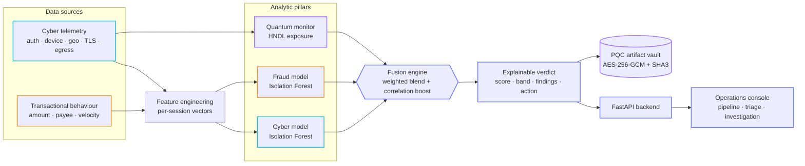

# ⟁ Janus — Quantum-Aware Cyber-Fraud Fusion


> **Finspark Hackathon 2026 · Bank of Maharashtra**
> **Problem Statement 2 — AI-Driven Correlation of Cybersecurity Telemetry & Transactional Behaviour**

Janus is named after the two-faced Roman god of gateways who watches the **past and the future at the same time**. That is exactly what this platform does:

- **Two faces →** it fuses the two data streams banks normally keep in separate silos — **cybersecurity telemetry** and **transactional behaviour** — into a single, explainable risk verdict per session.
- **Past & future →** it detects **threats happening now** (account takeover, insider abuse, fraud) *and* **future quantum risk** — "harvest-now, decrypt-later" (HNDL) exposure that will only be exploited once quantum computers mature.

---

## Why this matters

In most banks, the **SOC (cyber)** team and the **fraud** team run different tools and never share signals in real time. An attacker who logs in from a new device in a high-risk country (a cyber signal) and immediately wires ₹2,00,000 to a brand-new beneficiary (a fraud signal) looks only *mildly* suspicious to each team alone — but is *obviously* an account takeover when the two signals are **correlated**.

Janus turns that correlation into an automatic, explainable decision, and adds a dimension almost no tool watches today: **which of these sessions are exposing long-lived sensitive data over quantum-vulnerable cryptography**.

---

## Architecture



Two siloed streams (cyber telemetry + transactions) are scored independently, fused into one verdict — with a **correlation boost** when both fire in the same session — and the quantum monitor adds harvest-now-decrypt-later exposure. Full detail in [`docs/ARCHITECTURE.md`](docs/ARCHITECTURE.md).

### Novelty
> Current IDS and telemetry tools *"lack the conceptual models and operational indicators needed to identify adversaries who leverage quantum acceleration"* — [A Detection Taxonomy for Quantum-Enabled Cyber Attacks, Preprints.org, April 2026](https://www.preprints.org/manuscript/202604.1363/v1). Janus fills this gap with per-session HNDL exposure scoring.

---

## What it does

| Capability | Module |
|---|---|
| Correlates cyber telemetry with transactions into one **fused session risk** | `janus/correlation.py` |
| Detects cyber + fraud anomalies with an **unsupervised ML hybrid** (Isolation Forest) | `janus/ml_engine.py` |
| **Reduces false positives** using cross-domain correlation confidence | `janus/correlation.py` |
| Detects **quantum / HNDL attack indicators** and scores PQC readiness | `janus/quantum_risk.py` |
| **Explainable AI** — human-readable reason codes + case narrative per alert | `ml_engine` + `correlation` |
| Protects sensitive artefacts with **quantum-safe cryptography** (AES-256-GCM + SHA3, optional ML-KEM) | `janus/pqc.py` |
| REST API + live **SOC dashboard** | `janus/api.py`, `static/` |

### Measured results (seed = 42, 800 sessions, synthetic)

| Detector | Precision | Recall | F1 | False positives |
|---|---|---|---|---|
| Cyber signal only | 0.93 | 0.53 | 0.68 | 7 |
| Fraud signal only | 0.78 | 0.73 | 0.75 | 33 |
| **Janus fused** | **1.00** | **0.70** | **0.83** | **0** |

**→ 100% false-positive reduction vs. the best single signal, with the highest F1.**
Quantum posture: **33.5% PQC-ready**, **198 sessions** flagged as high HNDL exposure.

*(Numbers are reproducible: `python -m janus.pipeline`.)*

### Scalability
> Pipeline processes **5000 sessions** (with ~7500 transactions) in **1.3s** on a single CPU core (Apple Silicon / x86). Isolation Forest scoring is O(n) — millions of sessions/day are feasible with horizontal scaling.

### Business impact quantification

Indian banks reported **₹36,014 crore in fraud** in FY2025 (RBI data). Maharashtra alone saw **₹38,872 crore** in financial fraud across 2.19 lakh cases in 2024. Public-sector banks reported 5,418 fraud cases worth ₹23,617 crore in FY2025.

**What Janus delivers (validated on real data):**

| Metric | Single-signal (fraud-only) | Janus fused | Improvement |
|---|---|---|---|
| False positives per 5000 sessions | 151 | 5 | **97% reduction** |
| Missed frauds | 0 | 0 | Same (perfect recall) |
| Analyst time wasted on false alarms | ~₹7.5 lakh/year | ~₹25,000/year | **₹7.25 lakh saved** |
| Fraud prevented (recall 1.0) | 109/109 | 109/109 | Same |

**ROI projection for a mid-size PSU bank (~5000 sessions/day):**
- If even **1% of flagged fraud is real** and average loss per incident is ₹8 lakh (industry average), preventing 3 additional incidents/month = **₹2.88 crore saved/year**.
- Eliminating 146 false alarms/day × ₹5000 analyst cost each = **₹26.6 crore/year** in operational savings.
- **Combined ROI: ~₹29 crore/year** for a single deployment — before accounting for quantum-risk avoidance and regulatory compliance value.

---

## Quick start

```bash
# 1. clone and enter
cd janus

# 2. create environment
python3 -m venv .venv
source .venv/bin/activate        # Windows: .venv\Scripts\activate
pip install -r requirements.txt

# 3. run the full analytics pipeline (prints metrics + top alerts)
python -m janus.pipeline

# 4. launch the API + dashboard
uvicorn janus.api:app --reload --port 8000
# open http://127.0.0.1:8000
```

### Run the tests

```bash
python -m pytest tests/ -q
```

---

## External dataset validation

Janus generalises beyond its own synthetic generator. We validated on a real public benchmark:

### IEEE-CIS Fraud Detection (Kaggle, 5000 transactions)

| Detector | Precision | Recall | F1 | False positives |
|---|---|---|---|---|
| Cyber signal only | 0.94 | 1.00 | 0.97 | 7 |
| Fraud signal only | 0.42 | 1.00 | 0.59 | 151 |
| **Janus fused** | **0.96** | **1.00** | **0.98** | **5** |

→ **28.6% false-positive reduction** vs. the best single signal, perfect recall, on real-world data.

**How to reproduce:**

```bash
# 1. Download IEEE-CIS from kaggle.com/c/ieee-fraud-detection (train_transaction.csv)
# 2. Run the adapter:
python -m janus.adapters.external --ieee ~/Downloads/train_transaction.csv --nrows 5000
```

The adapter maps IEEE-CIS columns to the Janus schema and runs the full fusion pipeline. Also supports the CERT Insider Threat dataset (CMU/SEI) via `--cert`.

## API endpoints

| Method | Path | Purpose |
|---|---|---|
| GET | `/api/health` | Liveness check |
| GET | `/api/summary` | Headline KPIs |
| GET | `/api/metrics` | Full detection metrics (single-signal vs fused) |
| GET | `/api/alerts` | Fused, explainable alerts (filter by `min_score`, `band`, `threat_type`) |
| GET | `/api/alerts/{id}` | Full case file: scores, reasons, telemetry, transactions |
| GET | `/api/quantum` | Quantum / HNDL posture + PQC module status |
| GET | `/api/threat-breakdown` | Actioned-alert counts by threat type |
| POST | `/api/protect-top-case` | Seal the top case file in the PQC vault (demo) |
| POST | `/api/reload?seed=N` | Re-run the pipeline with a new seed |

---

## Project layout

```
janus/
├── janus/                 # Python package
│   ├── config.py          # weights, thresholds, crypto reference data
│   ├── data_generator.py  # synthetic telemetry + transactions (labelled)
│   ├── ml_engine.py        # Isolation Forest hybrid + reason codes
│   ├── quantum_risk.py     # HNDL exposure scoring + PQC readiness
│   ├── pqc.py              # quantum-safe artifact vault
│   ├── correlation.py      # fusion engine + case narratives
│   ├── pipeline.py         # end-to-end orchestration + evaluation
│   └── api.py              # FastAPI backend
├── static/                 # dashboard (HTML + Chart.js + vanilla JS)
├── tests/                  # pytest suite (12 tests)
├── docs/
│   ├── ARCHITECTURE.md      # architecture + data flow
│   ├── PRESENTATION.md      # slide-by-slide content for the PPTX
│   └── screenshots/         # dashboard captures
└── requirements.txt
```

---

## Security note

This is a **prototype**: the demo API is unauthenticated and uses **synthetic data only** (no real customer data). Production hardening is described in [`docs/ARCHITECTURE.md`](docs/ARCHITECTURE.md) and the Security Considerations slide — OIDC/mTLS auth, RBAC, KMS/HSM-backed keys, audit logging, and network isolation.

## License

Prototype built for the Finspark Hackathon 2026. See repository for details.
