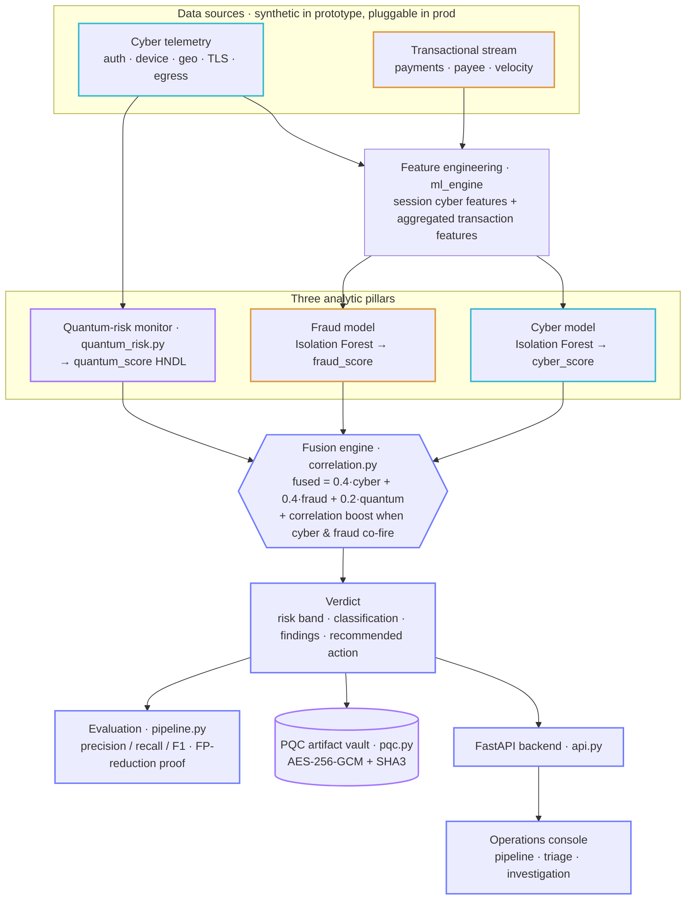

# Janus — Architecture

## 1. High-level architecture



## 2. The three analytic pillars

### 2.1 Cyber anomaly model
Unsupervised **Isolation Forest** over engineered telemetry features: device risk,
geo distance from the user's norm, impossible-travel flag, IP reputation, failed
logins, MFA usage, privilege escalation, off-hours deviation, privileged-account
flag. Unsupervised learning is deliberate — labelled attack data is scarce and
novel attacks have no signature.

### 2.2 Fraud anomaly model
A second Isolation Forest over **per-session aggregated transaction features**:
transaction count, total/max amount (log-scaled), new-beneficiary ratio,
high-risk-destination ratio, transfer ratio.

### 2.3 Quantum-risk monitor (the novel pillar)
For each session it classifies the TLS **key exchange** and **cipher** as
quantum-vulnerable (broken by Shor's algorithm — RSA, classic ECDHE, DH) or
quantum-safe (ML-KEM/Kyber, AES-256, SHA-3). It then computes an **HNDL exposure
score** that combines three factors, because a weak cipher alone is not the
danger — the danger is *long-lived sensitive data* moved in *bulk* over
*vulnerable crypto*, which can be captured today and decrypted years later:

```
quantum_score =  vulnerable key exchange   (+45)
              +  data longevity (PII 25y…)  (+25)
              +  bulk egress (>100 MB)       (+25)
              +  weak symmetric cipher       (+5)
```

## 3. Fusion & false-positive reduction

The core insight: **correlated multi-domain evidence is more trustworthy than
any single signal.** When both `cyber_score` and `fraud_score` exceed the
correlation trigger (55) in the *same* session, Janus applies a **correlation
boost** (+15) and labels the case *cross-domain correlated*. This is why the
fused verdict achieves **zero false positives** in evaluation while each single
signal alone produces 7–33: isolated single-domain spikes (a benign new device,
a large but legitimate transfer) don't clear the fused threshold, but genuine
attacks that light up both domains do.

## 4. Post-quantum artifact protection

`pqc.py` protects sensitive artefacts (case files, harvested-credential
watchlists) with primitives that are quantum-resistant **today**:

- **AES-256-GCM** — Grover only halves effective strength, leaving ~128-bit
  post-quantum security (NIST-recommended for the PQC era).
- **HKDF-SHA3-256** for key derivation, **SHA3-384** for integrity.
- Optional **ML-KEM-768 (Kyber)** key encapsulation via `liboqs` if installed;
  otherwise the manifest honestly records symmetric-only mode.

## 5. Data flow (request lifecycle)

1. On startup the API warms the pipeline: generate → engineer → fit → score →
   fuse → evaluate (cached in memory).
2. Dashboard calls `/api/summary`, `/api/metrics`, `/api/alerts`, `/api/quantum`.
3. Analyst clicks an alert → `/api/alerts/{id}` returns the full case file with
   correlated telemetry + transactions + reason codes.
4. Analyst clicks *Seal Top Case* → `/api/protect-top-case` encrypts the case
   file into the PQC vault.

## 6. Production hardening (beyond the prototype)

| Concern | Prototype | Production |
|---|---|---|
| Data | synthetic generator | Kafka/streaming connectors to SIEM + core banking |
| Auth | none (demo) | OIDC / mTLS, RBAC, per-analyst scopes |
| Keys | env var | KMS / HSM-managed master secret |
| Model lifecycle | fit on startup | scheduled retraining, drift monitoring, model registry |
| Scale | in-process pandas | Spark/Flink feature pipeline, model serving, vector store |
| Audit | none | immutable audit log of every decision & access |
```
